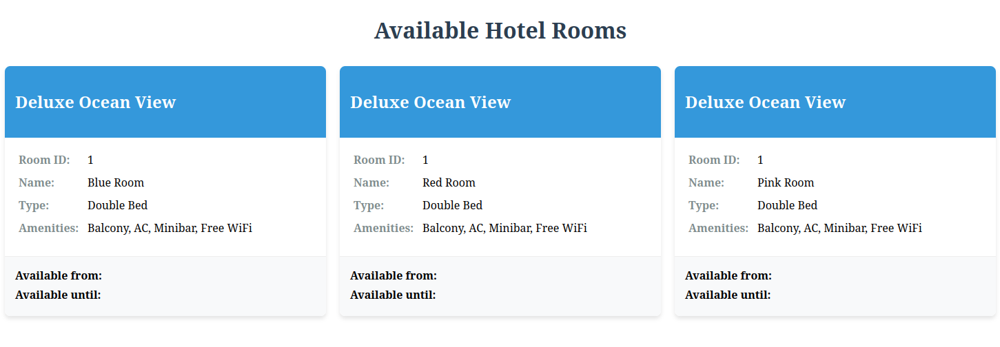

# Booking App

This application is a training example for those who want to tackle particular challenges of microservices.
This readme shows how you can get it up and running.

## Project structure
The project consists of a database (PostgreSQL), an REST api (spring boot) and a web ui (angular). 
Therefore the repository is organized into proper subfolders containing the above mentioned applications.\
On the root level a [docker compose file](./docker-compose.yml) deploying the whole system is placed.\
Let's now take a deeper look at the applications.

## ui
The ui resides in the [ui/mas-booking-app](./ui/msa-booking-app) and is realized with angular.\
The app is configured to launch at port 4500 and can locally be launched with
```console
ng serve
```
The app requires access to the booking api which is reachable under **localhost:8080/optimistic/booking**. \
If you need to change this you can find the hard coded value [here](./ui/msa-booking-app/src/app/service/room.service.ts).\
Nginx is used for deployment in docker ([Dockerfile](./ui/msa-booking-app/Dockerfile)).\

## booking-api
The api is implemented via spring-boot and launches locally with
```console
mvn spring-boot:run
```
The api opens an http listener at port 8080.
> [!NOTE]
> The api fails to start without a database. This will be corrected in the future.

The PostgreSql database is accessed by JPA which is configured in the [application.properties](./api/src/main/resources/application.properties).\
CORS is enabled for all paths (compare  [here](./api/src/main/java/org/distributed/consensus/Application.java)) by adding
the **corsConfigurer(...)** bean.

## database
The database is generated by the PostgreSQL image **postgres:17.2-alpine** as you can look it up in the [docker-compose file](./docker-compose.yml).\

## set up
First you have to create the 
Once the application is launched with
```console
docker compose up
```
the website can be accessed under http://localhost:80/index.html.\
In order to populate the database with proper rooms you can go with 
```
curl -H 'Content-Type: application/json' \
      -d '{"name": "Blue Room", "roomId": 1, "start": "2023-11-12", "finish": "2023-12-25"}' \
      -X POST \
      http://localhost:8080/optimistic/booking
```
You can now modify the fields name, roomId, start and finish in the body as you will.\
For a successful start the app looks like that



